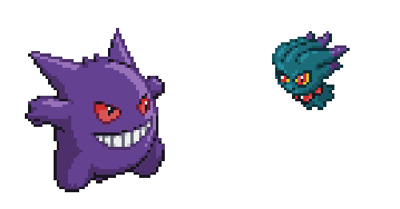

  

  

<h3 align="Center">📌 About me</h3>

<table width="100%" style="border-collapse: collapse;">
  <tr>
    <td style="background-color: #161b22; border: 1px solid #30363d; border-radius: 8px; padding: 20px; color: #c9d1d9; font-size: 15px; line-height: 1.6;">
      nice to meet you!
        
     My name is Gabriel Santos, and I am currently 20 years old. I live in Campinas, São Paulo; I am a young programming student who found his way into this field and is growing every day. I constantly strive to improve my technical skills and learn new things. I hold a technical certification in Systems Development from Senai Roberto Mange and currently work as a Junior Technician at Bosch, where I gain practical, hands-on experience in the technology sector. My goal is to keep growing—making mistakes, fixing them, and building increasingly better solutions. 🚀
    </td>
  </tr>
</table>

  

 

<h3 align="center">🛠️ Tech Stack & Tools</h3>
 

<table align="center" border="0" cellspacing="0" cellpadding="0" width="100%" style="border-collapse: separate; border-spacing: 15px 0;">
  <tr>
    <!-- Card 1: Front-end -->
    <td align="center" width="33%" style="background-color: #161b22; border-radius: 15px; border: 1px solid #30363d; padding: 20px; vertical-align: top;">
      <h4 style="color: #38BDF8; margin-top: 0;">💻 Front-end</h4>
      
      
User interfaces and experiences.

    </td>

   <table align="center" width="100%" border="0" cellspacing="0" cellpadding="0">
  <tr>
    <!-- Card 2: Back-end -->
    <td align="center" width="33%" style="background-color: #161b22; border-radius: 15px; border: 1px solid #30363d; padding: 20px; vertical-align: top;">
      <h4 style="color: #38BDF8; margin-top: 0;">⚙️ Back-end</h4>
      
      
Logic and business rules.

    </td>
      <!-- Card 3: Ferramentas e Design -->
    <table align="center" width="100%" border="0" cellspacing="0" cellpadding="0">
  <tr>
    <td align="center" width="33%" style="background-color: #161b22; border-radius: 15px; border: 1px solid #30363d; padding: 20px; vertical-align: top;">
      <h4 style="color: #38BDF8; margin-top: 0;">🎨Tools: Organization, design, and daily life</h4>
      <!-- Ícones principais do Skillicons -->
      
      
      
    </td>
  </tr>
</table>

 

<h3 align="center">🚀My Key Projects</h3>
 

<table align="center" border="0" cellspacing="0" cellpadding="0" width="100%" style="border-collapse: separate; border-spacing: 15px 15px;">
  <tr>
    <!-- Projeto 1: The Last of Us (JS) -->
    <td align="center" width="50%" style="background-color: #161b22; border-radius: 15px; border: 1px solid #30363d; padding: 20px; vertical-align: top;">
      <h4 style="color: #38BDF8; margin-top: 0;">🎮 The Last of Us (Game)</h4>
      

      A web game inspired by *The Last of Us*, developed entirely using JavaScript to incorporate mechanics and themes from the game's universe.
      

      
       
      
    </td>
    <!-- Projeto 2: Ecossistema App de Animes + API -->
    <td align="center" width="50%" style="background-color: #161b22; border-radius: 15px; border: 1px solid #30363d; padding: 20px; vertical-align: top;">
      <h4 style="color: #38BDF8; margin-top: 0;">📱 App de Animes & API</h4>
      

       Flutter/Dart mobile app integrated with its corresponding backend API to manage and provide all anime data.
      

      
       
      

        
        
      

    </td>
  </tr>
</table>

 

<h3 align="center">📫 Connect with me</h3>
 

  <!-- LinkedIn -->
  
  &nbsp;&nbsp;
  <!-- E-mail -->
  
  &nbsp;&nbsp;
  

 

  <h3 align="center">Thanks for visiting my profile! 👋🚀</h3>

  

